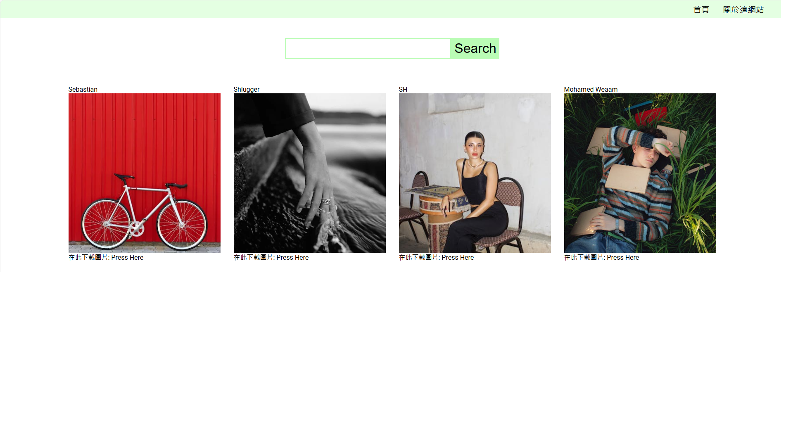

# Image Search and Download Website

This project is a web application that allows users to search, view, and download images from a wide variety of categories. The application leverages the Pexels API to fetch high-quality images, providing an intuitive user experience with a clean and responsive design.

## Features

- 🔍 **Search Images**: Users can search for images by entering keywords. The application fetches results from the Pexels API.
- 📂 **View Images**: Users can view high-quality images in a grid layout. Clicking on an image opens a detailed view with more information.
- ⬇️ **Download Images**: Users can download images directly from the website.
- 🌐 **Responsive Design**: The website is designed to be responsive and works well on both desktop and mobile devices.

## Technologies Used

- **React**: A JavaScript library for building user interfaces, providing a seamless experience with component-based architecture.
- **Pexels API**: An API that provides access to a vast library of free stock photos and videos.
- **SCSS/Sass**: A powerful CSS extension that allows for easier and more efficient styling.
- **Axios**: For making HTTP requests to the Pexels API.
- **React Router**: For handling routing in the single-page application.

## Getting Started

To get a local copy up and running, follow these simple steps.

### Prerequisites

- Node.js installed on your local machine.

### Installation

1. Clone the repository:
   ```bash
   git clone https://github.com/yourusername/image-search-app.git
   ```
2. Install NPM packages:
   ```bash
   npm install
   ```
3. Create a `.env` file and add your Pexels API key:
   ```bash
   REACT_APP_PEXELS_API_KEY=your_pexels_api_key_here
   ```
4. Start the development server:
   ```bash
   npm start
   ```

### Usage

1. Navigate to `http://localhost:3000` in your web browser.
2. Use the search bar to find images based on keywords.
3. Click on any image to view details and download options.

## Screenshots


_Description of the home page._


_Description of the search results page._

## Contributing

Contributions are what make the open-source community such an amazing place to learn, inspire, and create. Any contributions you make are **greatly appreciated**.

1. Fork the Project.
2. Create your feature branch (`git checkout -b feature/AmazingFeature`).
3. Commit your changes (`git commit -m 'Add some AmazingFeature'`).
4. Push to the branch (`git push origin feature/AmazingFeature`).
5. Open a Pull Request.

## License

Distributed under the MIT License. See `LICENSE` for more information.

## Acknowledgments

- [Pexels](https://www.pexels.com) for providing a rich collection of high-quality images.
- [React](https://reactjs.org) for the robust library.
- [Sass](https://sass-lang.com) for the amazing styling capabilities.

# 圖片搜尋與下載網站

這是一個網頁應用程式，允許用戶搜尋、查看和下載各種分類的圖片。該應用程式使用 Pexels API 來獲取高品質圖片，並提供直觀的用戶體驗和簡潔的響應式設計。

## 功能特點

- 🔍 **圖片搜尋**：用戶可以輸入關鍵字來搜尋圖片，應用程式會透過 Pexels API 獲取結果。
- 📂 **查看圖片**：用戶可以以網格形式查看高品質圖片，點擊圖片可以開啟詳細檢視頁面，顯示更多信息。
- ⬇️ **下載圖片**：用戶可以直接從網站下載圖片。
- 🌐 **響應式設計**：網站設計為響應式，適用於桌面和移動設備。

## 使用技術

- **React**：一個用於構建用戶界面的 JavaScript 庫，提供基於組件的架構，帶來流暢的體驗。
- **Pexels API**：一個提供大量免費庫存照片和視頻訪問的 API。
- **SCSS/Sass**：一個強大的 CSS 擴展，讓樣式設計更容易和高效。
- **Axios**：用於向 Pexels API 發送 HTTP 請求。
- **React Router**：用於處理單頁應用程式的路由。

## 快速開始

按照以下步驟在本地運行該應用程式。

### 先決條件

- 在本地機器上安裝 Node.js。

### 安裝步驟

1. 複製此 repo：
   ```bash
   git clone https://github.com/yourusername/image-search-app.git
   ```
2. 安裝 NPM 套件：
   ```bash
   npm install
   ```
3. 創建 `.env` 文件並添加你的 Pexels API 密鑰：
   ```bash
   REACT_APP_PEXELS_API_KEY=your_pexels_api_key_here
   ```
4. 啟動開發伺服器：
   ```bash
   npm start
   ```

### 使用方法

1. 在網頁瀏覽器中打開 `http://localhost:3000`。
2. 使用搜尋框輸入關鍵字搜尋圖片。
3. 點擊任意圖片查看詳細信息和下載選項。

## 截圖


## 貢獻

貢獻是讓開源社群成為一個令人驚奇的地方來學習、啟發和創造的原因。非常感謝你的貢獻！

1. Fork 本項目。
2. 創建你的功能分支（`git checkout -b feature/AmazingFeature`）。
3. 提交你的變更（`git commit -m 'Add some AmazingFeature'`）。
4. 推送到分支（`git push origin feature/AmazingFeature`）。
5. 開啟一個 Pull Request。

## 授權

此項目基於 MIT 許可證進行分發。查看 `LICENSE` 文件以了解更多信息。

## 致謝

- 感謝 [Pexels](https://www.pexels.com) 提供豐富的高品質圖片庫。
- 感謝 [React](https://reactjs.org) 提供穩健的開發庫。
- 感謝 [Sass](https://sass-lang.com) 提供出色的樣式設計能力。

---

### 作者

Billy Chen
